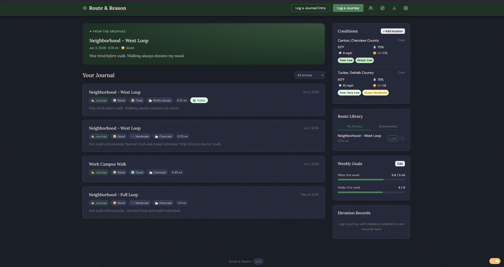

# Route & Reason — Walk Journal

A personal walk journal and mapping app. Log walks with snap-to-road routing, elevation profiles, weather, and pollen data. Keep a linked journal alongside your walk history. Connect with friends to share routes and entries. No build tools, no npm, no accounts — just static files and a Cloudflare Worker backend for API proxying and cross-device sync.

#### Demo:
https://badbox29.github.io/routeandreason/

---

#### Screenshot


---

## Features

- **Interactive map** — click to place waypoints, snap-to-road via OSRM, live distance tracking
- **Route tools** — undo last waypoint, reverse route, loop detection with one-tap close
- **Elevation profile** — grade-colored route overlay with climb/descent stats via Google Elevation API
- **Elevation personal records** — most climb, highest point, and most descent tracked across all walks
- **Weather & pollen sidebar** — current conditions via Open-Meteo; tree, grass, and weed pollen via Google Pollen API (daily cached)
- **Journey logging** — name, companions, energy levels, notes, and visibility per walk
- **@mention tagging** — tag other users in companions or notes; they see the entry in their feed regardless of friendship status; companions field supports both free text and @tags
- **Journal entries** — freeform entries linked to your walk history with mood and weather tracking
- **Route library** — save routes separately from walks; two tabs: My Routes and Bookmarked; load any route into a new journey
- **Route sharing** — use a friend's route as a template; route attribution tracks how many people have walked the same route
- **Route discovery** — browse public routes by location; search by city or use Near Me
- **Friends feed** — mutual friend system with request/approval flow; see friends' non-private entries with new-entry indicators
- **Mentions feed** — entries where you've been @tagged appear in a separate section below the main feed
- **Stats dashboard** — walks, miles, time, and calories by week/month/year/all-time; weekly miles bar chart; day-of-week breakdown; personal bests and patterns
- **Weekly goals** — set a weekly miles and/or walks target with a progress bar sidebar widget
- **Export & Import** — download all data as JSON backup, CSV spreadsheet, or GPX routes; restore from JSON backup with merge (nothing deleted)
- **Dark mode** — full light/dark theme toggle
- **Mobile responsive** — icon-only header on narrow screens; tested on folding phones
- **Cross-device sync** — token-based KV sync via Cloudflare Worker; copy your token to any browser to pick up where you left off

---

## File Structure

```
routeandreason/
├── index.html          # App entry point
├── css/
│   └── styles.css      # All styles
├── js/
│   └── app.js          # All client-side logic
├── icon.png            # App icon
├── worker.js           # Cloudflare Worker (deploy separately)
└── README.md
```

---

## Setup

### 1. Get the files

Clone or download this repository. The app is entirely static — `index.html`, `css/styles.css`, and `js/app.js` are all you need to run it.

Open `index.html` directly in a browser for local use, or host it on GitHub Pages (or any static host) for a permanent URL.

---

### 2. Deploy the Cloudflare Worker

The Worker proxies the Google Elevation and Pollen APIs (keeping your key server-side), handles snap-to-road via OSRM, and provides the KV storage backend for sync, friends, and route discovery.

A free Cloudflare account is sufficient for personal use. The $5/month Workers Paid plan is recommended if you expect heavier usage or want higher KV read/write limits.

#### 2a. Create the Worker

1. Log in to [dash.cloudflare.com](https://dash.cloudflare.com) and open **Workers & Pages**.
2. Click **Create** → **Create Worker**.
3. Give it a name (e.g. `routeandreason-worker`) and click **Deploy**.
4. Click **Edit code**, paste the entire contents of `worker.js` into the editor, and click **Deploy** again.
5. Note your worker URL — it will look like `https://your-worker-name.your-subdomain.workers.dev`.

#### 2b. Create a KV namespace

1. In the Cloudflare dashboard, go to **Workers & Pages → KV**.
2. Click **Create a namespace**, name it (e.g. `walk-journal-kv`), and click **Add**.
3. Go back to your Worker → **Settings → Bindings**.
4. Click **Add** → **KV Namespace**.
5. Set the **Variable name** to exactly `WALK_JOURNAL_KV` and select the namespace you just created.
6. Click **Deploy** to save the binding.

> **Why `WALK_JOURNAL_KV`?** The worker references `env.WALK_JOURNAL_KV` by that exact name. A different variable name will break all storage routes.

#### 2c. Set environment variables

In your Worker → **Settings → Variables and Secrets**, add the following:

| Variable | Type | Value |
|---|---|---|
| `GOOGLE_API_KEY` | Secret | Your Google Maps Platform key (Elevation API + Pollen API enabled) |
| `ALLOWED_ORIGINS` | Text | Comma-separated list of allowed origins (see below) |

**`ALLOWED_ORIGINS` example:**
```
https://badbox29.github.io,http://localhost:3000
```

Include every URL from which you or your family will access the app. Requests from unlisted origins are rejected with `403 Forbidden`.

> **Note:** Store `GOOGLE_API_KEY` as an **encrypted secret**, not a plain text variable, so it is never visible in the Cloudflare dashboard UI.

#### 2d. Enable Google APIs

1. Go to [console.cloud.google.com](https://console.cloud.google.com) and open your project.
2. Navigate to **APIs & Services → Library** and enable both the **Elevation API** and the **Pollen API**.
3. Billing must be active on the project — both APIs require it even within free tier usage.
4. Set **Application Restrictions** on your API key to **None** (the key lives server-side in the Worker, never in the browser).

> **Pollen API cost:** Google provides a $200/month free credit. Pollen results are cached daily in KV per location, so real-world usage stays well within the free tier.

#### 2e. Point the app at your Worker

1. Open the app in your browser.
2. Click the **Settings** (gear) icon.
3. Paste your Worker URL into the **Worker URL** field and click **Save**.

The app will immediately begin routing elevation, pollen, and storage operations through your Worker.

---

### 3. Cross-Device Sync

Your sync token is your identity in KV. Each browser generates one automatically on first load.

- On your **primary browser**: open Settings, copy your **Sync Token**, and save it somewhere safe.
- On a **new browser or device**: open Settings, paste your token into the **Sync Token** field, and click **Save**. Both browsers now share the same KV data.

All journal entries, journey history, saved routes, friends, and preferences sync automatically once a Worker URL and token are set.

---

### 4. Username & Friends

1. Open Settings and enter a **username** (3–32 characters, letters/numbers/underscores).
2. Click **Save** — your username is registered in KV and becomes discoverable by other users.
3. Open the **Friends** panel (people icon in the header) to send and receive friend requests by username or @username.
4. Once a request is mutually accepted, each person's non-private entries appear in the other's feed.

---

## Worker Routes Reference

| Method | Route | Description |
|---|---|---|
| `POST` | `/elevation` | Proxy to Google Elevation API |
| `POST` | `/osrm` | Proxy to OSRM snap-to-road (no key needed) |
| `GET` | `/pollen?lat=&lng=` | Google Pollen API proxy with daily KV cache |
| `GET` | `/storage/:token` | List all KV keys for a user token |
| `GET` | `/storage/:token/:key` | Read a KV value |
| `PUT` | `/storage/:token/:key` | Write a KV value |
| `DELETE` | `/storage/:token/:key` | Delete a KV value |
| `PUT` | `/username/:username` | Register a username → token mapping |
| `GET` | `/username/:username` | Look up a token by username |
| `DELETE` | `/username/:username` | Remove a username mapping |
| `POST` | `/notify/:targetToken` | Write a mention notification to another user's KV space |
| `GET` | `/public/entries` | List public entries (optional `?bbox=minLat,minLng,maxLat,maxLng`) |
| `PUT` | `/public/entries/:id` | Index a public entry |
| `DELETE` | `/public/entries/:id` | Remove entry from public index |
| `GET` | `/ping` | Health check (no auth required) |

---

## Data Storage

All data is stored in Cloudflare KV under your user token. Nothing is stored server-side beyond what you explicitly save. There are no accounts, no passwords, and no data leaves your browser except through your own Worker.

`localStorage` is used as a local cache and fallback when the Worker is unreachable. KV is the source of truth when both are present. The friends list is additionally backed up to `localStorage` as a resilience measure against KV propagation delays.

---

## API Keys & External Services

| Service | Used For | Key Required | Notes |
|---|---|---|---|
| Google Elevation API | Elevation profile and grade coloring | Yes | Server-side only via Worker; billing must be active |
| Google Pollen API | Tree, grass, and weed pollen levels | Yes | Server-side only via Worker; results cached daily in KV |
| OSRM | Snap-to-road routing | No | Proxied through Worker to avoid CORS |
| Open-Meteo | Weather conditions | No | Called directly from browser |
| Nominatim (OSM) | Route discovery location search | No | Called directly from browser |
| CartoDB | Map tiles | No | No key required |

---

## License

See LICENSE file.
